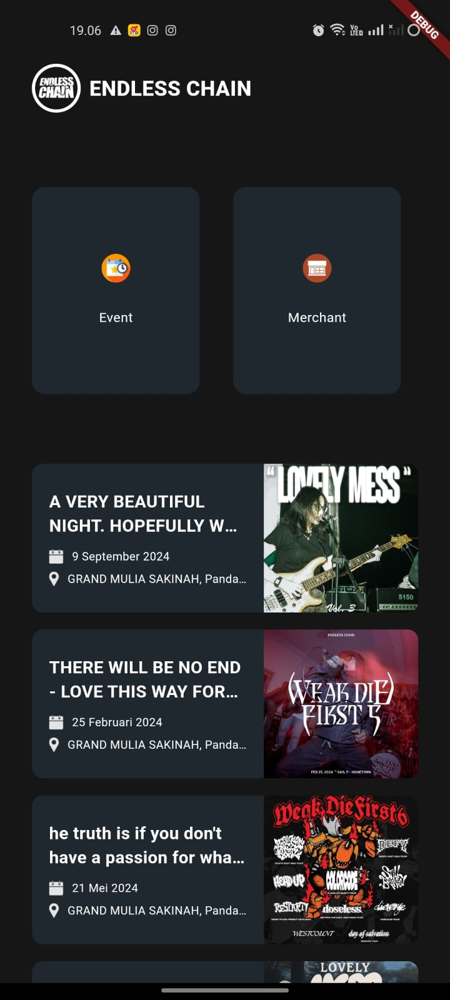
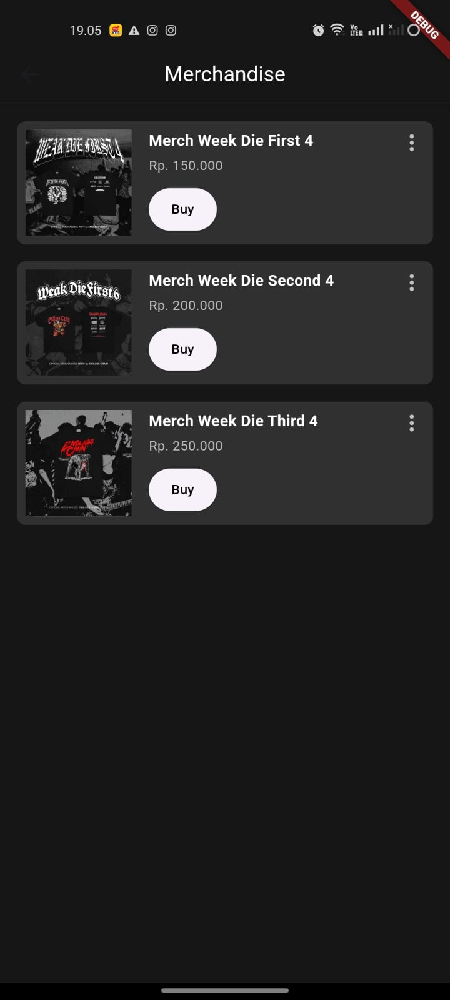

# Aplikasi Flutter - Nama Aplikasi

Deskripsi singkat aplikasi yang kamu buat.

## Tampilan Aplikasi

Berikut adalah beberapa tampilan dari aplikasi:

### Halaman 1

### Halaman 2

### Halaman 3

## Fitur

- Menampilkan daftar produk
- Mengarahkan ke WhatsApp untuk pembelian

## Instalasi

1. Clone repositori ini
2. Install dependensi: `flutter pub get`
3. Jalankan aplikasi: `flutter run`

# ec4eva

# ec4eva
# EndlessChain4EVA
